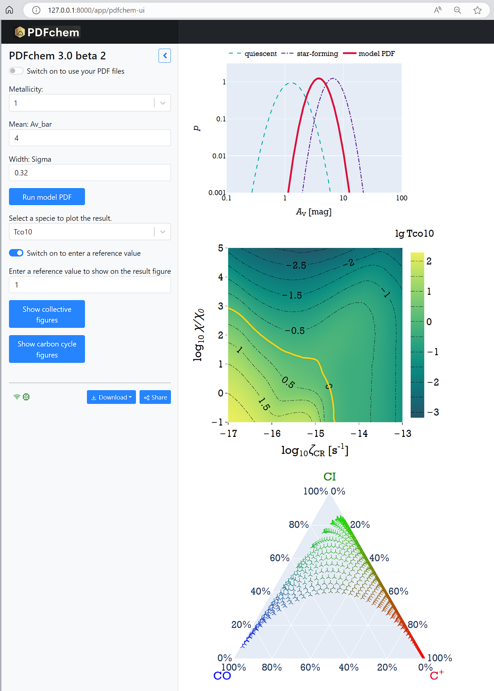

# PDFchem v3.0 beta 4 (2024-05)

This is an updated version of v2.0 and is based on the paper by [Bisbas et al. (2023)](https://ui.adsabs.harvard.edu/abs/2023MNRAS.519..729B/abstract). It is a continuation of the work by [Bisbas et al. (2019)](https://ui.adsabs.harvard.edu/abs/2019MNRAS.485.3097B/abstract). PDFchem is a combined Fortran 90/95 and Python algorithm. In principle, the Python script (written for Jupyter notebook) is a plotting tool in which PDFchem can also be executed and it serves as a wrapper.

If you use PDFchem for your research, please cite the above papers and [the code](https://ui.adsabs.harvard.edu/abs/2022ascl.soft11014B/abstract).

## Installing PDFchem

To run PDFchem, first download the PDR simulations from [this Zenodo link](https://zenodo.org/record/7310833).
Note that this new version use simulation files in the `HDF5` format, which are different from that used by the previous version. 

Once downloaded, you will need to untar it using the command
```
tar xvzf simulations-hdf5.tgz
```

This will extract four `HDF5` files in which all PDR files will be placed. For more information about the files and how they are structured, please refer to the [3D-PDR manual](https://uclchem.github.io/3DPDR_manual.pdf).

The folder structure should look like this:
```
.
├── PDFchem-ui.ipynb
├── README.md
├── avpdf.dat
├── avpdf_input
│   └── [some example input PDF files].dat
├── example
│   ├── PDFchem_input_noplot.py
│   ├── avpdf_diff.dat
│   ├── avpdf_sf.dat
│   ├── output_diff.dat
│   └── output_sf.dat
├── models
│   ├── Z0p1.hdf5
│   ├── Z0p5.hdf5
│   ├── Z1p0.hdf5
│   └── Z2p0.hdf5
├── output.dat
├── pdfchem.py
├── pdfchem_output
├── requirments.txt
└── webui_demo.jpg
```

Next, create a python environment with `conda`:
```
conda env create -f pdfchem-environment.yml
```
This will install all the necessary dependencies to run PDFchem.

(Alternatively, one may install the necessary dependencies with `pip install -r requirements.txt`)


**Windows:** We have tested the program under different operating systems. However, we recommend running `PDFchem` in the WSL which ensures that the program can have full functionality, such as saving Plotly figures into PDF files.

## Running PDFchem

In your terminal, go to the `PDFchem` folder and load the `PDFchem.ipynb` file  using `mercury` as the frontend UI:
```
cd PDFchem
mercury run
```



The `mercury` UI will appear in your browser and is self-explanatory. One can explore the different options on the left panel. It supports three types of PDF:

- The default mode is to make a model PDF based on parameters selected by users; specify metallicity, and the mean and width of a PDF on the left panel, then click the "Run model PDF" button to perform the calculations in the background.
- Turn the switch on the top ON to upload a PDF file, then the program will read the PDF (in most cases it will be from observations); click the button "Run a single PDF" then the program will do the calculations based on this PDF. Metallicity can be selected.
- Turn the second switch ON to run in batch mode on multiple PDFs provided by users. Please consider this as a demo; We encourage our users to write their own scripts in this case, as one likely has complicated file names, folder structures, and various ways of subsequent analysis, etc. 

**Results & Figures:**  After the calculation is finished, result files will be placed in a folder `./pdfchem_output`. The main window will show an example figure based on the result. One can select which species to plot with the dropdown menu. For the batch mode, this will only show the first figure as an example.

**Reference value**: To highlight a reference value on the figure, turn the switch below the dropdown menu ON to enter your value. For example, when you have a CO spectrum and you know its peak, then this can help you constrain the range of the resultant radiation strength and Cosmic Ray Ionization Rate.

**Note:** All calculations are performed for a log-normal distribution only. For any other distributions, you will need to make the relevant edits and modifications in the pdfchem_algorithm.py file. In this notebook you can insert your own mean (Av) and the width (sigma) of the Av-PDF you wish to consider. 

The list of available species can be found in the PDFchem.ipynb file:

|||||||||||
|--------|---------|----------|---------|---------|-------|--------|---------|---------|-------|
| 1: H3+ | 2: He+  | 3: Mg    | 4: H2+  | 5: CH5+ | 6: O2 |7: CH4+ |8: O+    |9: OH+   |10: Mg+|
|11: C+  |12: CH4  |13: H2O+  |14: H3O+ |15: CO+  |21: CH |22: CH3 |23: HCO+ |24: CH2+ |25: C  | 
|26: He  |27: CH+  |28: CO    |29: OH   |30: O    |31: H2 |32: H   |33: e-   |         |       |

The available brightness temperatures consider the carbon cycle only:
- [CII] 158um
- [CI] (1-0), (2-1)
- CO (1-0) ... (10-9)

## Alternative interactive plots

If you are interested in exploring the results with interactive plots, you can use the following notebook (with thanks to Theodoros Topkaras for the contribution)
```
jupyter notebook PDFchem_plotly.ipynb
```

## Deploy to your local site

If you want to run the PDFchem service on your local server so that other colleagues and use it on the intranet, there are a few necessary steps:

- Assuming that your server's IP is 1.2.3.4 and you want to use port 4321 for the service, you need to locate and edit the `mercury` setting file (for example `~/sw/miniconda3/envs/pdfchem/lib/python3.12/site-packages/mercury/server/settings.py`),  and add your IP `"1.2.3.4"` to the `ALLOWED_HOSTS` section
- Then, run the following command to run `mercury`:
  ```mercury run 0.0.0.0:4321 &```
- Then the service will be available to any computer in the intranet via `http://1.2.3.4:4321/app/pdfchem-mercury`

### Contact

For any questions, please do not hesitate to contact us at 
```
tbisbas@gmail.com / tbisbas@zhejianglab.com
xuejian.astro@gmail.com / jiangxuejian@zhejianglab.com
```

Thomas Bisbas ([thomasbisbas.com](http://thomasbisbas.com))
Xuejian Jiang ([Jiangxuejian.github.io](Jiangxuejian.github.io))

